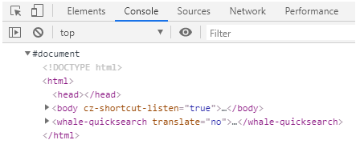
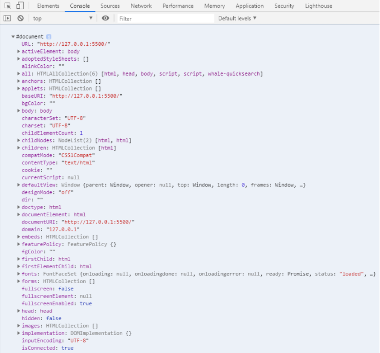
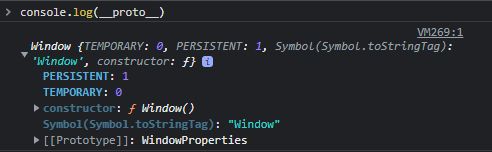
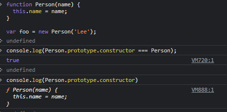
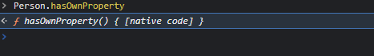
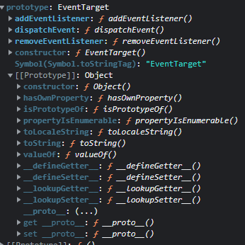
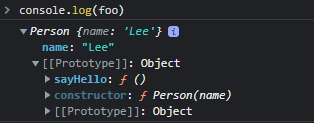
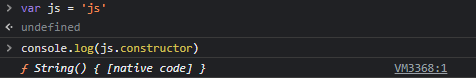

# 220306

## 프로토타입


### 프로토타입 객체

- 자바스크립트의 모든 객체는 자신의 부모 역할을 담당하는 객체와 연결되어 있다.
- 이러한 부모 객체를 프로토타입 객체라 한다.

```js
var student = {
  name: 'Lee',
  score: 90
};

// student에는 hasOwnProperty 메소드가 없지만 아래 구문은 동작한다.
console.log(student.hasOwnProperty('name')); // true

console.dir(student);
```


#### 자바스크립트의 모든 객체는 [[Prototype]]이라는 내부슬롯(인터널 슬롯)을 가지는데, 이 값은 null 혹은 객체이며 상속을 구현하는데 사용된다.

- get 은 허용되나 set은 허용되지 않음

- 접근은 ______proto______로 참조한다

### [[prototype]] vs prototype 프로퍼티

- 함수에서 해당한다
- 함수는 일반 객체와 달리 [[prototype]]과 prototype 프로퍼티 모두 소유한다


```js
function Person(name) {
  this.name = name;
}

var foo = new Person('Lee');

console.dir(Person); // prototype 프로퍼티가 있다.
console.dir(foo);    // prototype 프로퍼티가 없다.

```

> console.log : HTML과 유사한 트리에서 요소를 보여줌
>
> console.dir : JSON과 같은 트리에서 요소를 보여줌






### constructor 프로퍼티



프로토타입 객체는 constructor를 갖는다. 자기 자신을 생성한 객체를 가리킨다.




#### Prototype chain

자바스크립트는 특정 객체의 프로퍼티나 메소드에 접근하려고 할 때 해당 객체에 접근하려는 프로퍼티 또는 메소드가 없으면 [[prototype]]이 가리키는 링크를 따라 부모 역할을 하는 프로토타입 객체를 검색한다. 







#### 객체 리터럴 방식으로 생성된 객체의 프로토타입 체인

객체 리터럴로 생성된 객체는 내장함수인 Object() 생성자 함수로 생성한 것을 short-hand한것.

생성자 함수 ==< 함수

따라서 객체 리터럴 함수도 prototype 프로퍼티를 갖는다.


https://poiemaweb.com/js-prototype

그림참조!

#### 생성자 함수로 생성된 객체의 프로토타입 체인

> 함수 프로토타입의 용도 (in C)
>
> - int 이외의 형식을 반환하는 함수의 반환 형식을 설정한다.
> - 전체 프로토타입이 없는 경우 표준 변환이 수행되지만 매개 변수의 수에 대해 인수의 수나 형식이 확인되지 않는다.
> - 프로토타입은 함수를 정의하기 전에 해당 함수에 대한 포인터를 초기화하는데 사용된다.
> - 매개변수 목록은 함수 호출의 인수가 함수 정의의 매개변수와 일치하는지 확인하는데 사용된다.
>
> https://docs.microsoft.com/ko-kr/cpp/c-language/function-prototypes?view=msvc-170
>
> 함수 프로토타입의 용도(in JS)
>
> 
>
> 
>
> https://ko.javascript.info/function-prototype


#### 프로토타입 객체의 확장

- 프로토타입 객체도 객체이므로 프로퍼티를 추가/삭제할 수 있음 이는 곧 프로토타입 체인에 즉시 반영된다.

```js
function Person(name) {
  this.name = name;
}

var foo = new Person('Lee');

Person.prototype.sayHello = function(){
  console.log('Hi! my name is ' + this.name);
};

foo.sayHello();
```




#### 원시타입의 확장

- 원시타입으로 프로퍼티나 메소드를 호출할 때 원시타입과 연관된 객체로 일시적으로 변환되어 프로토타입을 공유한다.

```js
var str = 'test';
console.log(typeof str);                 // string
console.log(str.constructor === String); 
```



하지만 원시타입은 근본적으로 객체가 아니므로 프로퍼티나 메소드를 직접 추가할 수 없다.


#### 프로토타입 객체의 변경

```js
function Person(name) {
  this.name = name;
}

var foo = new Person('Lee');
// 프로토타입 객체의 변경
Person.prototype = { gender: 'male' };

var bar = new Person('Kim');

console.log(foo.gender); // undefined
console.log(bar.gender); // 'male'

console.log(foo.constructor); // ① Person(name)
console.log(bar.constructor); // ② Object()
```

1. constructor 프로퍼티는 Person()의 생성자 함수를 가리킨다.
2. 프로토타입 객체 변경 후, Person()의 생성자 함수의 Prototype 프로퍼티가 가리키는 프로토타입 객체를 일반 객체로 변경하면서 Person.prototype.constructor 프로퍼티도 삭제되었다. 따라서, 프로토타입 체인에 의해 bar.constructor 값은 Object() 생성자 함수(Object.prototype.constructor)가 된다.


#### 프로토타입 체인 동작 조건

- 객체의 프로퍼티를 참조하는 경우, 해당 객체에 프로퍼티가 없는 경우 프로토타입 체인이 동작한다.
- 객체의 프로퍼티에 값을 할당하는 경우 프로토타입이 동작하지 않는데, 프로퍼티 값이 있는경우 재할당하고 없는경우 동적으로 프로퍼티를 추가하기 때문이다

```js
function Person(name) {
  this.name = name;
}

Person.prototype.gender = 'male'; // ①

var foo = new Person('Lee');
var bar = new Person('Kim');

console.log(foo.gender); // ① 'male'
console.log(bar.gender); // ① 'male'

// 1. foo 객체에 gender 프로퍼티가 없으면 프로퍼티 동적 추가
// 2. foo 객체에 gender 프로퍼티가 있으면 해당 프로퍼티에 값 할당
foo.gender = 'female';   // ②

console.log(foo.gender); // ② 'female'
console.log(bar.gender); // ① 'male'
```


