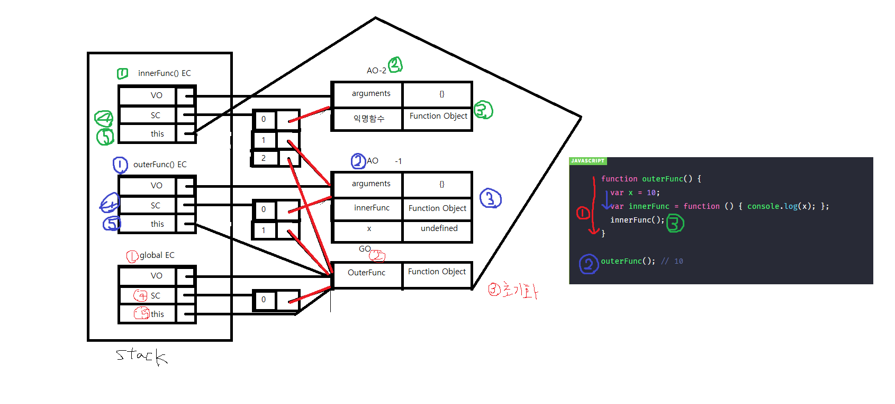
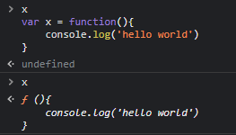
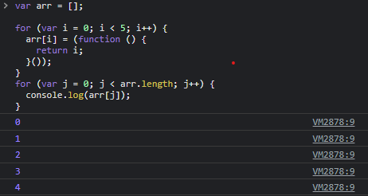

# 220311 ~ 220314

## 클로저(추가)

클로저는 자바스크립트 고유의 개념이 아니라 함수를 일급 객체로 취급하는 함수형 프로그래밍 언어(하스켈, 리스프, 얼랭, 스칼라)에서 사용되는 중요한 특성이다.

> MDN에서의 정의 - 클로저 : 함수와 그 함수가 선언됐을 때의 렉시컬 환경과의 조합이다.

```js
function outerFunc() {
  var x = 10;
  var innerFunc = function () { console.log(x); };
  innerFunc();
}

outerFunc(); // 10
```

함수 outerFunc 내에서 내부 함수 innerFunc가 선언되고 호출되었다. 이때 내부함수 innerFunc는 자신을 포함하고 있는 외부함수 outerFunc의 변수 x에 접근할 수 있다. 이는 함수 innerFunc가 함수 outerFunc의 내부에 선언되었기 때문이다.

> 스코프는 함수를 호출할 때가 아니라 함수를 어디서 선언하는지에 따라 결정된다.(렉시컬 스코프) 위 예제의 함수 innerFunc는 outerFunc 내부에서 선언되었기 때문에 innerFunc의 상위 스코프는 함수 outerFunc이다. 함수 innerFunc가 전역에서 선언되었다면 함수 innerFunc의 상위 스코프는 전역 스코프가 된다.

따라서 innerFunc는 자기 자신의 스코프, outerFunc, 전역 스코프를 모두 참조할 수 있다.

실행 컨텍스트의 관점에서 볼때,

내부함수 innerFunc가 호출되면 자신의 실행 컨텍스트가 실행 컨텍스트 스택에 쌓이고 VO(변수 객체)와 스코프 체인 그리고 this에 바인딩할 객체가 결정된다. 이때 스코프 체인은 전역 스코프를 가리키는 전역 객체와 함수 outerFunc의 스코프를 가리키는 함수 outerFunc의 활성 객체(AO)그리고 함수 자신의 스코프를 가리키는 활성 객체를 순차적으로 바인딩한다. 스코프 체인이 바인딩한 객체가 바로 렉시컬 스코프의 실체이다.



> 함수 컨텍스트의 경우 AO라는 활성 객체를 가리키며 컨트롤이 넘어갔을때( 코드가 실행 되었을 때) (함수 컨텍스트가)생성되어 스택에 쌓인다.

- 렉시컬 스코프 예




```js
function outerFunc() {
  var x = 10;
  var innerFunc = function () { console.log(x); };
  return innerFunc;
}

/**
 *  함수 outerFunc를 호출하면 내부 함수 innerFunc가 반환된다.
 *  그리고 함수 outerFunc의 실행 컨텍스트는 소멸한다.
 */
var inner = outerFunc();
inner(); // 10
```

위 경우는

return 이 있다는것 == 실행컨텍스트가 종료된다는 것 

즉 , outerFunc는 실행된 이후 콜스택에서 제거되었으므로 함수 outerFunc의 변수 x 또한 유효하지 않는게 맞다(원래는)

근데 접근이 가능한 이유는 자신을 포함하고 있는 외부함수가 내부함수보다 더 오래 유지되는 경우(위의 경우에는 변수 inner에 할당됨.), 외부 함수 밖에서 내부함수가 호출되더라도 외부함수의 지역변수에 접근할 수 있는데 이를 클로저(함수)라고 한다.


**MDN 정의를 다시 고려해 볼때 "함수와 함수가 선언되었을 때의 렉시컬 환경과의 조합"의 의미는 (반환된 내부)함수가 자신이 선언되었을 때의 환경인 스코프를 기억해 선언되었을 때의 환경 밖에서 호출되어도 그 환경(스코프)에 접근할 수 있는 함수를 말한다.**

클로저 == 자신이 생성될때의 환경을 기억하는 함수

여기서 클로저에 의해 참조되는 외부함수의 변수 즉 outerFunc함수의 변수를 자유변수라고 부른다.


### 클로저의 활용

클로저는 자신이 생성될 때의 환경을 기억해야 하기 때문에 메모리 차원에서 손해를 볼 수 있다. 하지만 클로저는 자바스크립트의 강력한 기능으로 이를 적극적으로 사용해야 한다.

#### 1. 상태 유지

- 현재 상태를 기억하고 변경된 최신 상태를 유지하는 것

```html
<!DOCTYPE html>
<html>
<body>
  <button class="toggle">toggle</button>
  <div class="box" style="width: 100px; height: 100px; background: red;"></div>

  <script>
    var box = document.querySelector('.box');
    var toggleBtn = document.querySelector('.toggle');

    var toggle = (function () {
      var isShow = false;

      // ① 클로저를 반환
      return function () {
        box.style.display = isShow ? 'block' : 'none';
        // ③ 상태 변경
        isShow = !isShow;
      };
    })();

    // ② 이벤트 프로퍼티에 클로저를 할당
    toggleBtn.onclick = toggle;
  </script>
</body>
</html>
```

① 즉시실행 함수는 함수를 반환하고 즉시 소멸한다. 익명함수가 생성되었을 때 렉시컬 환경에 속한 변수인 isShow는 클로저가 기억하는 변수다.

② 클로저를 이벤트 프로퍼티인 onclick에 할당한다. 이 이벤트리스너(이벤트 핸들러가 맞음)를 제거하지 않는 한 isShow는 클로저에 의해 소멸되지 않는다.

③ 버튼을 클릭하면 이벤트 핸들러인 클로저가 호출되고 isShow 값이 변경된다.

#### 2. 전역 변수의 사용 억제

```html
<!DOCTYPE html>
<html>
<body>
  <p>전역 변수를 사용한 Counting</p>
  <button id="inclease">+</button>
  <p id="count">0</p>
  <script>
    var incleaseBtn = document.getElementById('inclease');
    var count = document.getElementById('count');

    // 카운트 상태를 유지하기 위한 전역 변수
    var counter = 0;

    function increase() {
      return ++counter;
    }

    incleaseBtn.onclick = function () {
      count.innerHTML = increase();
    };
  </script>
</body>
</html>
```

위코드는 동작은 잘 하지만 오류를 발생시킬 가능성을 내포하고 있다. 여기서 전역변수인 counter에 의도치않게 값을 변경(재할당)할 경우에 위 코드는 개발자가 의도한 방향으로 작동하지 않게된다.

따라서 변수 counter는 increase 함수가 관리하는 것이 바람직하다.

```html
<!DOCTYPE html>
<html>
<body>
  <p>지역 변수를 사용한 Counting</p>
  <button id="inclease">+</button>
  <p id="count">0</p>
  <script>
    var incleaseBtn = document.getElementById('inclease');
    var count = document.getElementById('count');

    function increase() {
      // 카운트 상태를 유지하기 위한 지역 변수
      var counter = 0;
      return ++counter;
    }

    incleaseBtn.onclick = function () {
      count.innerHTML = increase();
    };
  </script>
</body>
</html>
```

위의 경우는 지역변수로 counter를 사용한 경우인데 이 경우는 문제가 counter가 계속 0으로 초기화 되어 이전 상태의 값을 기억하지 못한다는 점이다.


```html
<!DOCTYPE html>
<html>
  <body>
  <p>클로저를 사용한 Counting</p>
  <button id="inclease">+</button>
  <p id="count">0</p>
  <script>
    var incleaseBtn = document.getElementById('inclease');
    var count = document.getElementById('count');

    var increase = (function () {
      // 카운트 상태를 유지하기 위한 자유 변수
      var counter = 0;
      // 클로저를 반환
      return function () {
        return ++counter;
      };
    }());

    incleaseBtn.onclick = function () {
      count.innerHTML = increase();
    };
  </script>
</body>
</html>
```

따라서 위와같이 클로저를 사용해서 문제를 해결할 수 있다.

> 변수의 값은 누군가에 의해 언제든지 변경될 수 있어 오류 발생의 근본적 원인이 될 수 있다. 상태 변경이나 가변(mutable) 데이터를 피하고 **불변성(Immutability)을 지향**하는 함수형 프로그래밍에서 **부수 효과(Side effect)를 최대한 억제**하여 오류를 피하고 프로그램의 안정성을 높이기 위해 클로저는 적극적으로 사용된다.


```js
// 함수를 인자로 전달받고 함수를 반환하는 고차 함수
// 이 함수가 반환하는 함수는 클로저로서 카운트 상태를 유지하기 위한 자유 변수 counter을 기억한다.
function makeCounter(predicate) {
  // 카운트 상태를 유지하기 위한 자유 변수
  var counter = 0;
  // 클로저를 반환
  return function () {
    counter = predicate(counter);
    return counter;
  };
}

// 보조 함수
function increase(n) {
  return ++n;
}

// 보조 함수
function decrease(n) {
  return --n;
}

// 함수로 함수를 생성한다.
// makeCounter 함수는 보조 함수를 인자로 전달받아 함수를 반환한다
const increaser = makeCounter(increase);
console.log(increaser()); // 1
console.log(increaser()); // 2

// increaser 함수와는 별개의 독립된 렉시컬 환경을 갖기 때문에 카운터 상태가 연동하지 않는다.
const decreaser = makeCounter(decrease);
console.log(decreaser()); // -1
console.log(decreaser()); // -2
```

위 코드는 공유된 클로저 변수를 만들기 위한 코드이다. 인자로 함수를 넘겨주어 호출될때마다 공유된 클로저값이 바뀌도록 만들 수 있다.


#### 3. 정보의 은닉

**객체의 메소드는 객체의 프로퍼티뿐만 아니라 자신이 기억하는 렉시컬 환경의 변수에도 접근할 수 있기 때문에 생성자 함수를 활용해 클로저를 만들 수도 있다.**

```js
function Counter() {
  // 카운트를 유지하기 위한 자유 변수
  var counter = 0;

  // 클로저
  this.increase = function () {
    return ++counter;
  };

  // 클로저
  this.decrease = function () {
    return --counter;
  };
}

const counter = new Counter();

console.log(counter.increase()); // 1
console.log(counter.decrease()); // 0
```

이때 생성자 함수 Counter의 변수 counter는 this에 바인딩된 프로퍼티가 아니라 변수다.

만일 counter가 this에 바인딩된 프로퍼티라면 생성자 함수 Counter가 생성한 인스턴스르 통해 외부에서 접근이 가능(counter.counter)하지만 생성자 함수 Counter내에서 선언된 변수 counter는 생성자 함수 Counter 외부에서 접근할 수 없다. 하지만 생성자 함수가 생성한 메소드인 increase, decrease는 counter에 접근할 수 있기 때문에 private 키워드를 흉내낼 수 있다.




