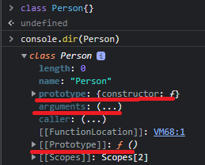
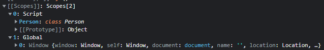
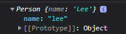
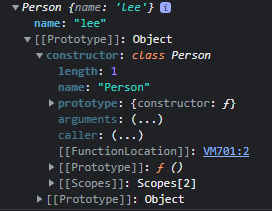
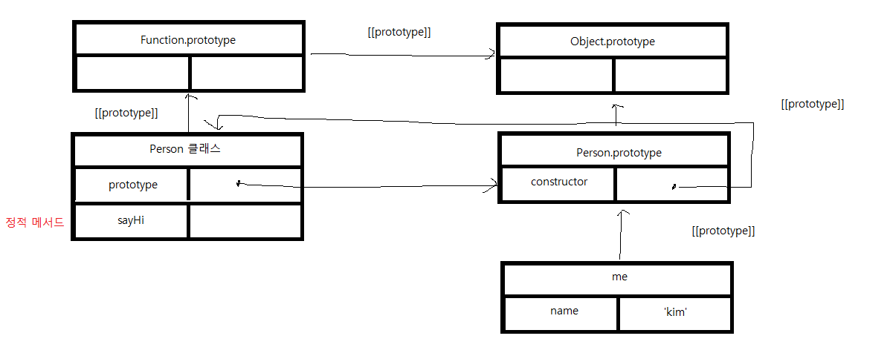
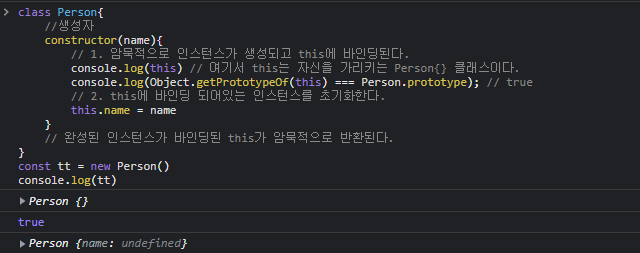
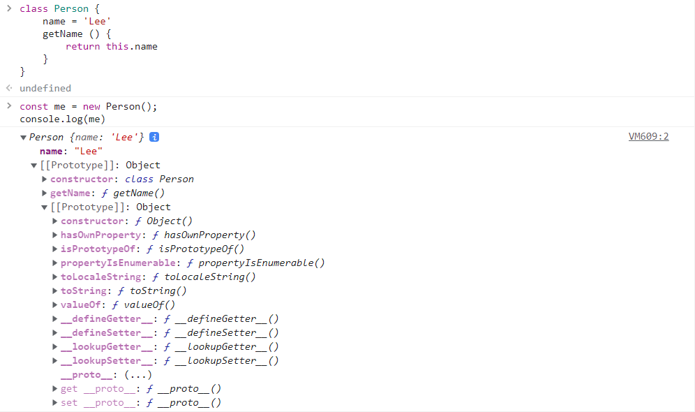
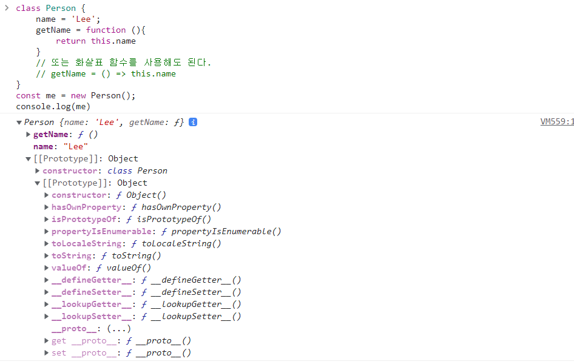
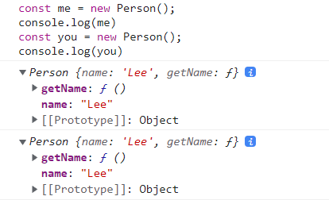

# 220315~220320

## 클래스1

### - 클래스는 프로토 타입의 문법적 설탕인가?

문법적 설탕(Syntax Sugar) :   읽는 사람 또는 작성하는 사람이 편하게 디자인 된 문법

프로토타입 객체 지향 언어 === 클래스가 필요 없는 객체지향 프로그래밍 언어


#### ES5 문법에서 클래스 없이 만든 객체 지향 언어의 상속 구현

```js
var Person = (function(){
    // 생성자 함수
    function Person(name){
        this.name =name;
    }
    //프로토타입 메서드 생성
    Person.prototype.sayHi = function(){
        console.log('Hi! My name is' + this.name)
    }
    
	return Person
}())
//생성자 함수를 통해 인스턴스 생성(me)
var me = new Person('Lee')
me.sayHi(); // Hi! My name is Lee
```


#### ES6 부터는 클래스를 도입


차이점 : 클래스와 생성자 함수는 모두 프로토타입 기반의 인스턴스를 생성하지만 정확히 동일하게 동작하지 않음 -> 생성자 함수보다 엄격하며 생성자 함수에서 제공하지 않는 몇몇 기능이 있음

> 1. 클래스를 new 연산자 없이 호출하면 에러가 발생한다. 하지만 생성자 함수를 new 연산자 없이 호출하면 일반함수로 호출이 가능
> 2. 클래스는 상속을 지원하는 extends 와 super 키워드를 제공한다. (생성자 함수X)
> 3. 클래스는 호이스팅이 발생하지 않는 것처럼 동작한다(?)
> 4. 클래스 내의 모든 코드는 Strict mode가 암묵적으로 지정되어 해제할 수 없다.
> 5. 클래스의 constructor, 프로토타입 메서드, 정적 메서드는 모두 프로퍼티 속성[[Enumerable]]값이 false다(열거되지 않는다.)

> Object.prototype.propertyIsEnumerable()이라는 빌트인 메서드가 있는데
>
> 요약하자면 이 메서드는 지정된 속성이 열거 가능하고, 개체 자체의 속성인지 여부를 나타냄
>
> ```js
> const object1 = {};//객체
> const array1 = [];//배열
> object1.property1 = 42;//프로퍼티 추가
> array1[0] = 42;//배열 값 추가
> 
> console.log(object1.propertyIsEnumerable('property1'));
> // expected output: true
> 
> console.log(array1.propertyIsEnumerable(0));
> // expected output: true
> 
> console.log(array1.propertyIsEnumerable('length'));
> //length 는 Object의 메서드임
> // expected output: false
> ```
>
> 
>
> https://developer.mozilla.org/en-US/docs/Web/JavaScript/Reference/Global_Objects/Object/propertyIsEnumerable


### 클래스 정의 

일반적으로 파스칼 케이스를 사용하는 것을 권장

```js
class Person{}

```

함수와 유사하게 표현식으로 정의도 가능하고 익명 클래스를 사용할 수도 있다.

```js
const Person = class{}
const Person = class MyClass {}
```


**클래스를 표현식으로 정의할 수 있다는 것은 클래스가 ''값''으로 사용할 수 있다는 것이다. (클래스 === 일급 객체**)

- 무명의 리터럴로 생성할 수 있다.(즉 런타임에 생성이 가능하다)
- 변수나 자료구조(객체, 배열)에 저장할 수 있다
- 함수의 매개변수로 전달할 수 있다.
- 함수의 return 값으로 사용할 수 있다.


클래스의 메서드


클래스에는 메서드만 정의가 가능하다.

정의할 수 있는 메서드 

1. 생성자(constructor)
2. 프로토타입
3. 정적 메서드

```js
class Person {
	constructor(name){
        //인스턴스 생성 및 초기화
        this.name = name
    }
    //프로토타입 메서드
    sayHi(){
        console.log(`Hi! My name is ${this.name}`);
    }
    //정적 메서드
    static sayHello(){
        console.log('Hello')
    }
   
}
//인스턴스를 생성
const me = new Person('Lee')
//인스턴스의 프로퍼티 참조
console.log(me.name)
//프로토타입 메서드 호출
me.sayHi();
//정적 메서드 호출
Person.sayHello();
```


#### 1. constructor(생성자)

constructor는 인스턴스를 생성하고 초기화하기 위한 특수한 메서드다. contructor라는 이름을 변경할 수는 없다.

```java
//in JAVA
public class Study{
	//public Study(String name){} //Default Constructor 자동생성
    public static void main(String [] args){
        Study st = new Study();
    }
}
```

```python
#in python
class Study:
    def __init__(self, name):	//생성자 함수
        self.name = name
```

```js
//in JavaScript
class Study{
    constructor(name){
        this.name = name
    }
}
```

객체 > 함수 > 클래스

앞서 언급한 함수 객체의 프로퍼티처럼 클래스도 함수이기 때문에 함수 객체의 프로퍼티를 모두 갖고 있다.

​	





##### 1.1 constructor 인스턴스의 내부

```js
class Person {
    constructor(name){
        this.name = name;
    }
}

const me = new Person('lee')

console.log(me)
```





this에 추가한 name 프로퍼티가 인스턴스의 프로퍼티로 추가됨.

따라서 생성자 내부의 this는 생성자 함수와 마찬가지로 클래스가 생성한 인스턴스 (위 코드에서는 me)를 가리킴





위 인스턴스의 프로토타입 내부슬롯을 열어보면 constructor 가나오는데 이 prototype 내부슬롯의 메서드와 class의 constructor는 아무런 관련이 없다. 프로토타입의 프로퍼티 constructor는 모든 프로토타입이 가지는 프로퍼티이며, 생성자 함수를 가리킨다.


- constructor는 클래스 내부에서 한개만 존재한다

- 생략할수 있다.(암묵적으로 정의된다.)

- 프로퍼티를 추가하려면 constructor 내부에서 this에 인스턴스 프로퍼티를 추가한다.

  ```js
  class Person{
  	constructor(name, address){
          //인수로 인스턴스 초기화
          //인수가 없을경우 고정값으로도 추가가 가능하다.
          this.name = name;
          this.address = address;
      }
  }
  //인수로 초기값을 constructor에 전달 
  const me = new Person('kim', 'incheon')
  ```

  여기서 constructor는 return이 없어야하는데 그 이유는 클래스가 new 연산자와 함께 호출되면 생성자 함수와 동일하게 암묵적으로 this(인스턴스)를 반환하기 때문이다.

  만일 constructor 내부에 

  ```js
  constructor{
  	return {}
  }
  ```

  위와 같은 코드를 작성할 경우 암묵적인 this 반환이 무시된다.

  하지만 명시적으로 원시(타입)값을 반환하면 원시값 반환은 무시되고 암묵적으로 this가 반환된다.

  ```js
  constructor{
  	return 100
  }
  ```

  따라서 constructor 내부의 return 문은 반드시 생략해야한다.

##### 2. 프로토타입 메서드

프로토타입 메서드를 생성하기 위해서는 다음과 같이 명시적으로 프로토타입에 메서드를 추가해야하한다.

```js
//함수 프로토타입에 추가할때
Person.prototype.sayHi= function(){
    console.log(`hi${this.name}`)
}
// 클래스 내부에서 추가할때
//클래스 내부
class Person {
    ...
	sayHi(){
    	console.log(`hi${this.name}`)
	}
}
```

##### 3. 정적 메서드

정적메서드는 인스턴스를 생성하지 않아도 호출할 수 있는 메서드(이미 초기화가 완료된 메서드)

```js
//생성자 함수에서 정적메서드 추가
Person.sayHi = function (){}

//클래스내부에서 정적메서드 추가
class Person{
    ...
    static sayHi(){
        console.log('hi')
    }
}
//인스턴스 생성 없이 클래스로 호출함

Person.sayHi();
```

반면 정적 메서드는 인스턴스로 호출할 수 없다. 정적 메서드가 바인딩된 클래스는 인스턴스의 프로토타입 체인 상에 존재하지 않기 때문이다.





##### 3.1 정적 메서드와 프로토타입 메서드의 차이

메서드 내부에서 인스턴스 프로퍼티를 참조할 필요가 있는경우 this를 사용해야 하며 this를 사용한다는 뜻은 프로토타입 메서드를 사용해야한다는 의미이다.

예제를 보면 다음과같다.


```js
class Square{
	//정적 메서드
    static area(width, height){
        return width * height;
    }
}
console.log(Square.area(10, 10))

class Square{
    constructor(width,height){
        this.width = width;
        this.height = height;
        
    }
    area(){
        return this.width * this.height
    }
}
const square = new Square(10, 10);
console.log(square.area())
```


프로토타입 메서드는 인스턴스로 호출해야 하기 때문에 메서드 내부의 this 는 프로토타입 메서드를 호출한 인스턴스를 가리킨다. (위 예제의 경우 square 객체)

물론 this를 사용하지 않더라도 prototype 메서드로 정의할 수 있다. 그러나 this를 사용하지 않는 메서드는 정적 메서드로 정의하는 것이 좋다.

표준 빌트인 객체인 Math, Number, JSON, Object 등은 다양한 정적 메서드를 가지고 있으며 애플리케이션 전역에서 사용할 수 있다.(이를 유틸리티 함수라 한다.)

```
Math.max(1, 2, 3);
Number.isNaN(NaN)
JSON.stringfy({a: 1})
Object.is({},{}); 
```

>  **```Object.is()```** 메서드는 두 값이 [같은 값](https://developer.mozilla.org/ko/docs/Web/JavaScript/Equality_comparisons_and_sameness)인지 결정합니다.
>
> https://developer.mozilla.org/ko/docs/Web/JavaScript/Reference/Global_Objects/Object/is
>
> **`JSON.stringify()`** 메서드는 JavaScript 값이나 객체를 JSON 문자열로 변환합니다. 
>
> https://developer.mozilla.org/ko/docs/Web/JavaScript/Reference/Global_Objects/JSON/stringify


### 클래스에서 정의한 메서드들의 특징

1. function 키워드를 생략한 메서드 축약 표현을 사용한다
2. 객체 리터럴과는 다르게 클래스에 메서드를 정의할때는 콤마가 필요없다

```js
a = {a1: '2', a3: '4'}
class Person{
	area(){},//(x)
	area1(){}
}
```

3. 암묵적으로 strict mode로 실행된다.
4. 열거할수 없다.
5. new 연산자와 함께 호출할 수 없다.  (추가가 필요)


#### 클래스 호이스팅

클래스 선언문으로 정의한 클래스는 함수 선언문처럼 소스코드 평가 과정, 즉 런타임 이전에 먼저 평가되어 함수 객체를 생성한다. 이때 클래스가 평가되어 생성된 함수 객체는 생성자 함수로서 호출할 수 있는 함수로서 호출할 수 있는 함수 즉 constructor이다. 이 시점에 프로토타입도 더불어 생성된다. 

프로토타입과 생성자 함수는 항상 쌍으로 존재하기 때문이다.

하지만 클래스는 클래스 정의 이전에 참조할 수 없다.

```js
console.log(Person);
class Person{}

//위의 예제를 출력하면 cannot access before initialization이라는 오류가 출력된다.
//아직 선언(실행 컨텍스트 생성 이전 코드 평가) 이후에 초기화(실행 컨텍스트 이후)가 안되었다는 뜻이다.
```


그렇다고 호이스팅이 발생하지 않은 것은 아니다.

```js

const Person = '';
{
    // 호이스팅이 발생하지 않는다면 아래 log는 ''가 찍혀야 정상이다. (함수 블록이 아님 === 스코프가 전역 스코프에 바인딩되어있음)
    console.log(Person) // cannot access 'Person' before initialization
    //클래스 선언문
    class Person{}
}

```

위 예시 코드르 보았을 때 클래스 호이스팅은 분명히 발생하는 것을 알 수 있다.

**단, 클래스는 let, const 키워드로 선언한 변수처럼 호이스팅된다.(=== 선언과 초기화가 동시에 일어나지 않는다.)**

따라서 클래스 선언문 이전에 일시적 사각지대(TDZ)에 빠지기 때문에 호이스팅이 발생하지 않는 것처럼 동작한다.


----------------------------------------------------------16일은 여기까지

### 인스턴스 생성

클래스는 생성자 함수이며 반드시 new 연산자와 함께 호출되어 인스턴스를 생성한다.

```js
class Person{}
const me = new Person();
console.log(me); Person{}
```

그냥 new 없이 쓰면 에러가 발생한다

```js
class Person{}
const me = Person();
TypeError : Class constructor Foo cannot be invoked without 'new'
```


#### constructor 내부의 this가 가리키는 것

함수 -> new 연산자로 호출 -> 함수 내부에서의 this ==> 함수 자기자신

1. new 연산자와 함께 클래스를 호출하면 constructor의 내부 코드가 실행되기에 앞서 암묵적으로 빈 객체가 생성된다. 이 빈 객체가 바로 클래스의 인스턴스다.

이때 인스턴스의 prototype으로 클래스의 prototype 프로퍼티가 가리키는 객체가 설정된다. 암묵적으로 생성된 빈 객체는 this에 바인딩 된다.

따라서 constructor 내부의 this는 인스턴스를 가리킨다.


2. constructor의 내부 코드가 실행되면 this에 바인딩 되어있는 인스턴스를 초기화한다.

=> this에 바인딩 되어있는 인스턴스에 프로퍼티를 추가하고 constructor가 인수로 전달받은 초기값으로 인스턴스 프로퍼티 값을 초기화한다.(constructor가 생략되면 이 과정도 생략된다.)


3. 클래스의 모든 처리가 끝나면 완성된 인스턴스가 바인딩된 this가 암묵적으로 반환된다.

예시코드

```js
class Person{
    //생성자
	constructor(name){
        // 1. 암묵적으로 인스턴스가 생성되고 this에 바인딩된다.
        console.log(this) // 여기서 this는 자신을 가리키는 Person{} 클래스이다.
        console.log(Object.getPrototypeOf(this) === Person.prototype); // true
        // 2. this에 바인딩 되어있는 인스턴스를 초기화한다.
        this.name = name
    }
    // 완성된 인스턴스가 바인딩된 this가 암묵적으로 반환된다.
}

console.log(Person.this)
```




#### 프로퍼티

인스턴스 프로퍼티는 constructor 내부에서 정의해야 한다.

```js
class Person{
    constructor(name){
        // 인스턴스 프로퍼티
        this.name = name;
    }

const me = new Person('kim')
console.log(me) // Person { name: 'kim' }
```


#### 접근자 프로퍼티

접근자 프로퍼티는 자체적으로는 값을 갖지 않고 다른 데이터 프로퍼티의 값을 읽거나 저장할 때 사용하는 접근자 함수로 구성된 프로퍼티이다.

```js
class Person {
    constructor(firstName, lastName) {
        this.firstName = firstName;
        this.lastName = lastName;
    }
    get fullName() {
        return `${this.firstName} ${this.lastName}`;
    }
    set fullName(name) {
        [this.firstName, this.lastName] = name.split(' ');
    }
}
// 데이터 프로퍼티를 통한 프로퍼티 값의 참조
console.log(`${person.firstName} ${person.lastName}`)

// 접근자 프로퍼티를 통한 프로퍼티 값의 저장
// 접근자 프로퍼티 fullName에 값을 저장하면 setter 함수가 호출된다.
person.fullName('jooyun park');
console.log(person) // {firstName : 'jooyun', lastName : 'park'}

//접근자 프로퍼티를 통한 프로퍼티 값의 참조
console.log(person.fullName) // jooyun park

//fullName은 접근자 프로퍼티다
//접근자 프로퍼티는 get, set, enumerable, configurable 프로퍼티 속성을 갖는다.
console.log(Object.getOwnPropertyDescriptor(person, 'fullName'))
```


접근자 프로퍼티는 자체적으로 값을 가지지 않고 다른 데이터의 프로퍼티의 값을 읽거나 저장할 때 사용하는 접근자함수(getter/ setter)함수로 구성되어 있다.

getter는 인스턴스 프로퍼티에 접근할 때마다 프로퍼티 값을 조작하거나 별도의 행위가 필요할 때 사용

getter는 메서드 이름 앞에 get 키워드를 사용해 정의한다.

setter는 인스턴스 프로퍼티에 값을 할당할 때마다 프로퍼티 값을 조작하거나 별도의행위가 필요할 때 사용

setter는 메서드 이름 앞에 set 키워드를 사용해 정의한다.

**setter는 무언가를 프로퍼티에 할당해야 할 때 사용하므로 반드시 매개변수(반드시 1개)가 있어야한다.**

> 접근자 프로퍼티 설명자
>
> - getter, setter
>
> https://velog.io/@bigbrothershin/JavaScript-%EC%A0%91%EA%B7%BC%EC%9E%90-%ED%94%84%EB%A1%9C%ED%8D%BC%ED%8B%B0-getter-setter
>
> - enu, config MDN
>
> https://developer.mozilla.org/ko/docs/Web/JavaScript/Reference/Global_Objects/Object/defineProperty
>
> - enu, config 설명
>   https://developer-talk.tistory.com/277
>
> 1. get - 인수가 없는 함수로, 프로퍼티를 읽을 때 동작함
> 2. set - 인수가 하나인 함수로, 프로퍼티에 값을 쓸 때 호출됨
> 3. enumerable - 속성이 객체의 속성 열거가 가능하면 true, 기본값은 false
>
> - 기본적으로 객체의 속성은 열거가 가능하기 때문에 반복문으로 접근 가능하다
>
>   ```js
>   const userInfo = {
>   	name : 'Kim hyunsong',
>       age : 28,
>       address: 'Incheon'
>        
>    }
>    console.log(Object.getOwnPropertyDescriptor(userInfo, 'name').enumerable);
>   for (const key in userInfo) {
>       console.log(`key : ${key}`)
>   }
>   ```
>
> - 그러나 enumarable 속성을 false로 설정하면 객체의 속성을 열거할 수 없다
>
>   ```js
>   const userInfo = {
>   	name : 'Kim hyunsong',
>       age : 28,
>       address: 'Incheon'
>              
>   }
>   Object.defineProperty(userInfo, 'name', {enumerable: false})
>   console.log(Object.getOwnPropertyDescriptor(userInfo, 'name').enumerable);
>   for (var key in userInfo) {
>       console.log(`key : ${key}`)
>   }
>   ```
>
>   name 값을 접근 못한다.
>
>   4. configurable - 속성의 값을 변경할 수 있고, 객체에서 삭제할 수도 있으면 true, 기본값은 false 
>
>   - 이 속성은 false로 설정되면 해당 속성을 잠그고 enumerable 및 configurable 을 다시 변경하는 것을 방지한다. 해당 속성을 삭제하지 못하도록 방지하지만, 쓰기(writable)는 가능하다.
>
>   ```js
>   const userInfo = {
>   	name : 'Kim hyunsong',
>       age : 28,
>       address: 'Incheon'
>              
>   }
>   Object.defineProperty(userInfo, 'name', {configurable: false})
>   console.log(Object.getOwnPropertyDescriptor(userInfo, 'name').enumerable);
>   Object.defineProperty(userInfo, 'name', {enumerable: false})
>   ```
>
>   
>
> 
>
>
> https://developer-talk.tistory.com/277
>
> Object.getOwnPropertyDescriptor() : 객체의 속성에 대한 설명자를 확인하는 함수


#### 클래스 필드 정의 제안

클래스 필드 : 클래스 기반 객체지향 언어에서 클래스가 생성할 인스턴스의 프로퍼티

자바 코드 예시

```java
public class Person {
    // 1. 클래스 필드 정의
    // 클래스 필드는 클래스 몸체에 this 없이 선언해야 한다.
    //(초기화)
    private String firstName = "";
    private String lastName = "";
    //생성자
    // 3. this는 언제나 클래스가 생성할 인스턴스를 가리킨다.
    Person(String firstName, String lastName) {
        // 여기서 this는 클래스 필드를 의미하는데 사용한 이유는 생성자 또는 메서드의 매개변수 이름과 동일할 때 클래스 필드임을 명확히 하기 위해 사용한다.		//값을 갱신
        this.firstName = firstName;
        this.lastName = lastName;
    }
    public String getFullName() {
        // 2.클래스 필드 참조
        // this 없이 클래스 필드를 참조할 수 있다.
        return firstName + " " + lastName;
    }
}
```

자바가 위 예제와 같이 클래스 필드를 마치 변수처럼 클래스 몸체에 this 없이 선언하는 것과 달리

자바스크립트의 클래스는 인스l스의 프로퍼티를 선언하고 초기화하려면 **반드시 constructor 내부에서 this에 프로퍼티를 추가해야한다**


자바스크립트 코드예시

```js
class Person {
	constructor(firstName, lastName){
        this.firstName = firstName;
        this.lastName = lastName
    }
    //여기도 마찬가지로 인스턴스 프로퍼티에 접근하기 위해서는 this를 사용하여 참조해야 한다.
    console.log(this.firstName)
	consoel.log(this.lastName)
}
const instance1 = new Person('hyunsong', 'kim')
```

자바스크립트 클래스 몸체에는 메서드만 선언할 수 있다. 클래스 몸체에 자바와 유사하게 클래스 필드를 선언하면 문법 에러가 발생하는데 최신 브라우저(Chrome 72 이상) 또는 Node.js(12버전 이상)에서 실행하면 정상 동작한다.

```js
class Person {
    name = 'lee';
}
const me = new Person('lee')
```

클래스 몸체에서 클래스 필드를 정의하는 경우 this에 클래스 필드를 바인딩하면 오류가 난다. 왜냐하면 constructor와 메서드 내부에서만  유효하기 때문이다.

```js
class Person {
	this.name = ''; //SyntaxError
}
```


클래스 필드를 참조하는 경우 반드시 this를 사용해야 하며

```js
class Person {
	name = 'KIM'
	constructor() {
		console.log(name) // ReferenceError
	}
}
```

클래스 필드에 초기값을 할당하지 않으면 undefined를 갖는다.

```js
class Person {
	name;
	
}
const me = new Person();
console.log(me.name) // undefined
```


인스턴스를 생성할 때 외부의 초기값으로 클래스 필드를 초기화해야 한다면 constructor에서 클래스 필드를 초기화해야 한다.

```js
class Person {
	name;
	// 인스턴스 생성자의 매개변수임
	constructor(name) {
		this.name = name
	}
}
```

이때 this에 해당하는 프로퍼티가 없다면 동적으로 추가되기 떄문에 굳이 정의할 필요가 없다.

또한 함수는 일급객체이기때문에 클래스 필드에 할당 후 메서드를 정의하는 것도 가능하다.

```js
// 원래라면
class Person {
    name = 'Lee'
    getName () {
        return this.name
    }
}
//할당 후 메서드 정의
class Person {
    name = 'Lee';
    getName = function (){
        return this.name
    }
    // 또는 화살표 함수를 사용해도 된다.
    // getName = () => this.name
}
const me = new Person();
console.log(me)
console.log(me.getName())
```

위 




아래와 같이 사용할 경우 이 함수는 프로토타입 메서드가 아닌 인스턴스 메서드가 된다.



그래서 아래처럼 사용할 경우



이렇게 인스턴스 메서드가 인스턴스가 생성될때마다 생성된다.(낭비)
