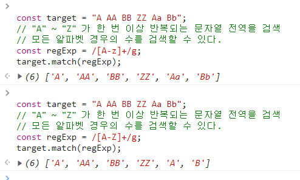

# (220418) RegExp

정규 표현식 : 일정한 패턴을 가진 문자열의 집합을 표현하기 위해 사용하는 형식 언어

패턴매칭기능 제공

> 특정 패턴과 일치하는 문자열을 검색하거나 추출 또는 치환할 수 있는 기능


```js
const tel - "010-1234-5육78";
const regExp = /^\d{3}-\d{4}-\d{4}$/;
regExp.test(tel);
```

## 1. 정규표현식의 생성

// : 시작, 종료 기호

regexp : 패턴

i : 플래그

```js
const target = 'Is this all there is?';
// 패턴 : is
// 플래그 : i => 대소문자를 구별하지 않고 검색한다.
const regexp = /is/i;
// test 매서드는 target 문자열에 대해 정규 표현식 regexp  패턴을 검색하여 매칭 결과를
// 불리언 값으로 반환함
regexp.test(target);
```


RegExp 생성자 함수를 사용하여 RegExp 객체를 생성할 수도 있다.

```js
new RegExp(pattern [, flags])
```


```js
const target = "Is this all there is?";
const regexp = new RegExp(/is/i);
// const regexp = new RegExp(/is/, 'i');
// const regexp = new RegExp('is', 'i');
regexp.test(target); // true
```

변수를 사용해 동적으로도 생성이 가능하다.

```js
const count = (str, char) => (str.match(new RegExp(char, 'gi')) ?? []).length;
count("Is this all there is?", "is"); // 3 
count("Is this all there is?", "xy"); // 0
```


## 2. RegExp 메서드

### 1. RecExp.prototype.exec

인수로 전달받은 문자열에 대해 정규 표현식의 패턴을 검색하여 매칭 결과를 배열로 반환한다.

매칭 결과가 없는 경우 null을 반환한다.

```js
const target = "Is this all there is?";
const regExp = /is/;
regExp.exec(target);
//['is', index: 5, input: 'Is this all there is?', groups: undefined]
// 매칭 결과 : 패턴, 인덱스, 입력값, 그룹?
```


### 2.RegExp.prototype.test

인수로 전달받은 문자열에 대해 정규 표현식의 패턴을 검색하여 매칭 결과를 불리언 값으로 반환

```js
const target = "Is this all there is?";
const regExp = /is/;
regExp.test(target); // true
```


### 3. String.prototype.match 

대상 문자열과 인수로 전달받은 정규 표현식과의 매칭 결과를 배열로 반환

```js
const target= "Is this all there is?";
const regExp = /is/;
target.match(regExp)
```

> exec과의 차이 : 문자열 내의 모든 패턴을 검색하는 g 플래그를 지정해도 첫 번째 매칭 결과만 반환한다. 하지만 match 메서드는 g 플래그가 지정되면 모든 매칭 결과를 배열로 반환한다.

```js
const target = "Is this all there is?";
const regExp = /is/g;
target.match(regExp); // ["is", "is"]
```

## 플래그

여러가지 플래그

1. i : Ignore case - 대소문자를 구별하지 않고 패턴을 검색한다.
2. g : Global - 대상 문자열 내에서 패턴과 일치하는 모든 문자열을 전역 검색한다.
3. m : Multi line - 문자열의 행이 바뀌더라도 패턴 검색을 계속한다.

**순서 상관 없이 하나 이상의 플래그를 동시에 설정할 수도 있다.**

플래그를 사용하지 않은 경우 대소문자를 구별해서 패턴을 검색하고 첫 번째 매칭 대상만 검색하고 종료함.

```js
const target = "Is this all there is?";
//target 문자열에서 is 문자열을 대소문자를 구별하여 한 번 검색
target.match(/is/);
//target 문자열에서 is 문자열을 대소문자를 구별하지 않고 한 번만 검색
target.match(/is/i);
//target 문자열에서 is 문자열을 대소문자를 구별하여 전역 검색
target.match(/is/g);
// target 문자열에서 is 문자열을 대소문자를 구별하지 않고 전역 검색
target.match(/is/ig);
```


## 패턴

패턴은 /로 열고 닫으며 문자열의 따옴표는 생략함.

어떤 문자열 내에 패턴과 일치하는 문자열이 존재할 때 "정규표현식과 매치한다"고 표현함.


(임의 생략)

### 임의의 문자열 검색

. 은 문자 한개를 의미함.

다음 예제의 경우 3개를 연속한 단어를 내용과 상관 없이 문자열과 매치

```js
const target = "Is this all there is?";
const regExp = /.../g;
target.match(regExp); // ["Is ", "thi","s a", "ll", "the, "re", "is?"]
```


### 반복 검색

{m, n}은 앞선 패턴(다음 예제의 경우 A)이 최소 m번, 최대 n번 반복되는 문자열.

콤마 뒤 공백이 있을경우 정상동작 하지 않음

```js
const target = "A AA B BB Aa Bb AAA";
const regExp = /A{1, 2}/g;
target.match(regExp) // null


const target = "A AA B BB Aa Bb AAA";
const regExp = /A{1,2}/g;
target.match(regExp) // (5) ['A', 'AA', 'A', 'AA', 'A']
```

{n}은 앞선 패턴이 n번 반복되는 문자열을 의미함 ({n} === {n, n})

```js
const target = "A AA B BB Aa Bb AAA";
const regExp = /A{2}/g;
target.match(regExp); //(2) ['AA', 'AA']
```

{n, }은 앞선 패턴이 최소 n번 이상 반복되는 문자열을 의미한다.

```js
const target = "A AA B BB Aa Bb AAA";
const regExp = /A{2,}/g;
target.match(regExp); // ["AA", "AAA"]
```


+는 앞선 패턴이 최소 한번 이상 반복되는 문자열을 의미함. 즉 +는 {1,}과 같음


```js
const target = "A AA B Ba Aa Ba AAA";
const regExp = /A+/g;
target.match(regExp);
```


?는 앞선 패턴이 최대 한 번(0번 포함) 이상 반복되는 문자열을 의미함.

다음 예제의 경우 /colou?r/는 colo다음 u가 최대 한 번(0번 포함)이상 반복되고 'r'이 이어지는 문자열 'color', 'colour'와 매치한다.

```js
const target = "color colour";
const regExp = /colou?r/g;
target.match(regExp);
```


### OR 검색

| === or 

```/A|B/ 는 'A' 또는 ' B'를 의미한다```

```js
const target = 'A AA B BB Aa Bb';

//'A' 또는 'B'를 전역 검색한다.
const regExp = /A|B/g;
target.match(regExp); //['A', 'A', 'A', 'B', 'B', 'B', 'A', 'B']
```


분해되지 않는 단어 레벨로 검색 (+)

```js
const target = 'A AA B BB Aa Bb';
// 'A' 또는 'B'가 한 번 이상 반복되는 문자열을 전역 검색한다.
// 'A', 'AA', 'AAA' 또는 'B', 'BB', 'BBB'
const regExp = /A+|B+/g;
target.match(regExp); // (6) ['A', 'AA', 'B', 'BB', 'A', 'B']
```


범위 지정 [] 내에 - 부호 표시

```js
const target = "A AA BB ZZ Aa Bb";
// "A" ~ "Z" 가 한 번 이상 반복되는 문자열 전역을 검색
// 모든 알파벳 경우의 수를 검색할 수 있다.
const regExp = /[A-z]+/g;
target.match(regExp);
```



이렇게 대문자부터 소문자로 쓰면 전부를 검색할 수 있음...!!!


대소문자 구분않고 알파벳 검색 방법

```js
const target = "A AA BB ZZ Aa Bb";
const regExp = /[A-Za-z]+/g;
target.match(regExp);
```


숫자 검색

```js
const target = "AA BB 12,345";
const regExp = /[0-9]+/g;
target.match(regExp); // ["12", "345"]
```


쉼표 포함 숫자검색

```js
const target = "AA BB 12,345";
const regExp = /[0-9,]+/g;
target.match(regExp); // ["12,345"]
```


같은 예제로 \d 를 사용할 수 있다.

```js
const target = "AA BB 12,345";
const regExp = /[\d,]+/g;
target.match(regExp); // ["12,345"]
// 대문자 D의 경우 "0"~"9"가 아닌 문자(숫자가 아닌 문자)또는 ","가 한 번 이상 반복되는 문자열을 전역 검색함.
regExp = /[\D,]+/g;
target.match(regExp); //(2) ['AA BB ', ',']
```


\w : 알파벳, 숫자, 언더스코어 

=== [A-Za-z0-9_]

대문자 W는 소문자 w와 반대로 동작함

```js
const target = "Aa Bb 12,345 _$%^%";
let regExp = /[\w,]+/g;
target.match(regExp); //(4) ['Aa', 'Bb', '12,345', '_']
```


### NOT 검색

[]내의 ^는 not을 의미한다.

\D = **[^0-9]**

\W = **[^A-Za-z0-9_]**


```js
const target = "AA BB 12 Aa Bb";
const regExp = /[^0-9]+/g;
target.match(regExp); //(2) ['AA BB ', ' Aa Bb']
```


### 시작 위치로 검색

^

```js
const target = "https://naver.com";
const regExp = /^https/;
target.match(regExp); // ['https', index: 0, input: 'https://naver.com', groups: undefined]
```


### 마지막 위치로 검색

$ 

```js
const target= "https://poiemaweb.com";
const regExp = /com$/;
target.match(regExp); //['com', index: 18, input: 'https://poiemaweb.com', groups: undefined]
```

