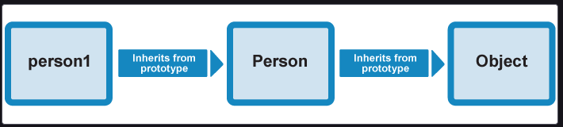
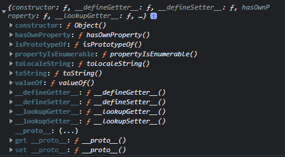

# 220304

## 함수

- 목적 : 코드의 재사용
- 기능 : 객체 생성, 객체의 행위 정의(메소드), 정보 은닉, 클로저, 모듈화 등


### 함수의 정의 방식

#### - 함수 선언문

```js
//function 키워드 + 함수명 ( 매개변수 )
function square(number) {
    // 함수 몸체
  return number * number;
}
```

사실 위 선언문은 

```js
var square = function square(number) {
  return number * number;
};
```

js 엔진에 의해 위와같이 만들어지기 때문에 변수명으로 호출되는 것이다.


#### - 함수 표현식

- 함수명을 생략할 수 있다. 이를 익명함수라 한다.

- 함수는 일급객체이므로 변수에 할당할 수 있는데, 변수에 할당된 함수는 함수명이 아니라 함수를 가리키는 참조값을 저장함.

```js
// 기명 함수 표현식(named function expression)
var foo = function multiply(a, b) {
  return a * b;
};


// 익명 함수 표현식(anonymous function expression)
var bar = function(a, b) {
  return a * b;
};

console.log(foo(10, 5)); // 50
console.log(multiply(10, 5)); // Uncaught ReferenceError: multiply is not defined
```


#### - Function 생성자 함수

위 두가지의 정의 방법은 모두 내장함수 Function 생성자 함수로 함수를 생성하는 것을 단순화 시킨 축약법(short-hand)이다

```js
new Function(arg1, arg2, .... functionBody)
```

일반적으로 사용하지 않는다.


### 함수 호이스팅

- 호이스팅 : var 선언문이나 function 선언문 등 모든 선언문이 해당 Scope의 선두로 옮겨진 것처럼 동작하는 특성

- 함수 선언문으로 정의된 함수는 JS 엔진이 스크립트가 로딩되는 시점에 바로 이를 초기화 하고 이를 VO에 저장한다. 즉 , 함수 선언, 초기화, 할당이 한번에 이루어진다.
- 하지만 함수 표현식의 경우 함수 호이스팅이 아닌 변수 호이스팅이 발생한다.
  - 이는 변수 생성 및 초기화와 할당이 분리되어 진행되기 때문이다.

```js
var res = square(5); // TypeError: square is not a function


var square = function(number) {
  return number * number;
}
//선언 -> 호출 -> 할당
```

이와같은 문제로 함수 표현식만을 사용할 것을 권고 

- 함수 호이스팅이 함수 호출 전 반드시 함수를 선언해야 한다는 규칙을 무시하므로 코드의 구조를 엉성하게 만든다고 함.

- 또한 수많은 코드를 VO에 저장하기때문에 애플리케이션의 응답속도는 현저하게 떨어짐

> VO(Variable Object) : 선언된 데이터 ( 변수, 함수 ) 들이 저장되는 Special Object이다.
>
> 변수나 함수를 선언하는 것 === VO에 새로운 속성을 추가하는 것
>
> ECStack 내부
>
> ```js
>   var ECStack = [
>     globalExecutionContext: {
>       VO: {
>         // Execution Context 진입 시 x 변수는 undefined 로 초기화되며, 
>         // A 함수는 Function Object 로 초기화된다.
>         x: undefined, 
>         A: <reference to function>
>       }
>     }
>   ];
> ```
>
> http://mohwa.github.io/blog/javascript/2015/10/14/vo-inJS/

 

### 일급 객체

- 무명의 리터럴로 표현이 가능
- 변수나 자료구조(객체, 배열)에 저장 가능
- 함수의 매개변수에 전달 가능
- 반환값으로 사용 가능


### 매개변수 vs 인수

매개변수는 함수 내에서 변수와 동일하게 메모리 공간을 확보하며 함수에 전달한 인수는 매개변수에 할당된다. 만약 인수를 전달하지 않으면 매개변수는 undefined로 초기화 된다.

```js
// p1, p2 는 매개변수
var foo = function (p1, p2) {
  console.log(p1, p2);
};
//1 은 인수
foo(1); // 1 undefined
```


- 매개변수에서도 참조형이냐 기본 자료형이냐에 따라서 call-by-value, call-by-reference를 따른다


#### 함수 객체의 프로퍼티

함수도 프로퍼티를 가질 수 있다.

함수는 일반 객체와는 다른 함수만의 프로퍼티를 갖는다.


> Object prototypes
>
> js에서는 객체를 상속하기 위해 프로토타입이라는 방식을 사용한다.
>
> 
>
> 
>
> 
>
> 위 사진에서 person1.valueOf()를 실행했을 때, 
> valueOf 의 메서드가 person1 에 없는 경우 prototype chain을 통해 person에서 valueOf를 찾는다
> person에서 valueOf 메서드가 없는 경우 Object로 올라가 valueOf를 찾는다
>
> 
>
> 
>
> prototype 속성 : 상속받은 멤버들이 정의 된 곳
>
> 
>
> 
>
> 
>
> https://developer.mozilla.org/ko/docs/Learn/JavaScript/Objects/Object_prototypes


#### arguments 프로퍼티 

- arguments 객체는 함수 호출 시 전달되 인수들의 정보를 담고 있는 유사 배열 객체이며 함수 내부에서 지역변수처럼 사용된다.(외부에서 사용 불가)

  > 유사배열 객체란 ? 
  >
  > length 프로퍼티를 가진 객체를 말한다. 배열은 아니므로 배열 메서드를 사용하는 경우 에러가 발생한다. 따라서 배열 메서드를 사용하기 위해서는 
  >
  > Function.prototype.call, Function.prototype.apply 를 사용해야 한다.

  ```js
  function sum() {
    var res = 0;
  
    for (var i = 0; i < arguments.length; i++) {
      res += arguments[i];
    }
  
    return res;
  }
  
  console.log(sum());        // 0
  console.log(sum(1, 2));    // 3
  console.log(sum(1, 2, 3)); // 6
  ```

  위와같이 가변 인자 함수를 구현할때 유용하게 사용할 수 있다.


#### caller 프로퍼티 : 자신을 호출한 함수


```js
function foo(func) {
  var res = func();
  return res;
}

function bar() {
  return 'caller : ' + bar.caller;
}

console.log(foo(bar)); // caller : function foo(func) {...}
```


#### length 프로퍼티 : 함수 정의시 작성된 매개변수 개수


#### name 프로퍼티 : 함수 명


#### ______proto______  접근자 프로퍼티

- 모든 객체는 [[Prototype]]이라는 내부 슬롯이 있음(=== 프로토타입 객체)
- 프로토타입 객체 : 객체간 상속을 구현하기 위해 사용함(Class)
- ______proto______ 프로퍼티는 프로토타입 객체에 접근하기 위해 사용하는 접근자 프로퍼티이다.
- 내부 슬롯에 직접 접근할수 없기 때문에 위와같이 접근한다

```js
// __proto__ 접근자 프로퍼티를 통해 자신의 프로토타입 객체에 접근할 수 있다.
// 객체 리터럴로 셍성한 객체의 프로토타입 객체는 Object.prototype이다.
console.log({}.__proto__ === Object.prototype); // true
```

- 함수도 객체이므로 ______proto______ 접근자 프로퍼티를 통해 프로토타입 객체에 접근할 수 있다.

```js
// 함수 객체의 프로토타입 객체는 Function.prototype이다.
console.log((function() {}).__proto__ === Function.prototype); // true
```


#### prototype 프로퍼티

prototype 프로퍼티는 함수 객체만이 소유하는 프로퍼티이다. 즉, 일반 객체에는 prototype 프로퍼티가 없다.

```js
// 함수 객체는 prototype 프로퍼티를 소유한다.
console.log(Object.getOwnPropertyDescriptor(function() {}, 'prototype'));
// {value: {…}, writable: true, enumerable: false, configurable: false}

// 일반 객체는 prototype 프로퍼티를 소유하지 않는다.
console.log(Object.getOwnPropertyDescriptor({}, 'prototype'));
// undefined
```


### 함수의 다양한 형태

#### 즉시 실행 함수

```js
(function () {
  // ...
})();
```


#### 내부함수

자식함수는 부모함수의 변수에 접근할 수 있지만, 부모함수는 자식함수의 변수에 접근할 수 없다

내부함수는 부모함수 외부에서 접근할 수 없다.


#### 콜백 함수 : 명시적으로 호출하는 방식이 아닌 특정 이벤트가 발생했을 때 시스템에 의해 호출되는 함수를 말한다.

주로 비동기식 처리 모델에 사용된다.

> 비동기식 처리 모델 : 처리가 종료하면 호출될 함수(콜백함수)를 미리 매개변수에 전달하고 처리가 종료하면 콜백함수를 호출하는 것

콜백함수는 콜백 큐에 들어가 있다가 해당 이벤트가 발생하면 호출됨.

콜백함수는 클로저이므로 콜백큐에는 단독으로 존재하다가 호출되어도 콜백함수를 전달받은 함수의 변수에 접근할 수 있음

```js
//뭔가 예제가 잘못된거같다
function doSomething(str) {
  setTimeout(function () {
    console.log('My name is ' + str);
  }, 100);
}

doSomething('Lee'); // My name is Lee
```


