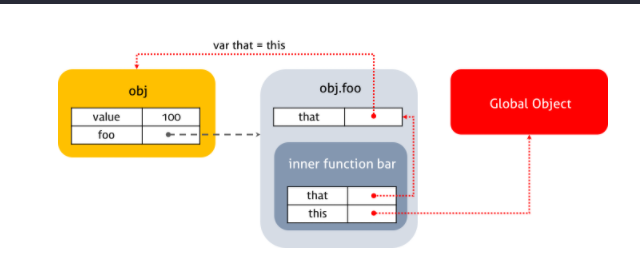
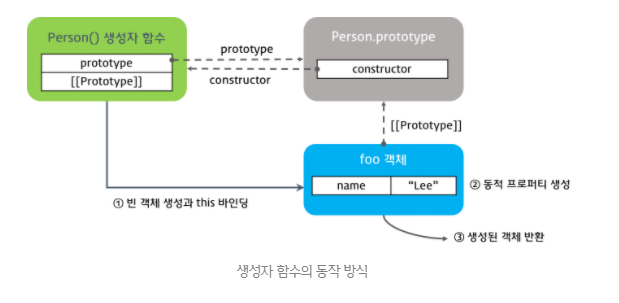
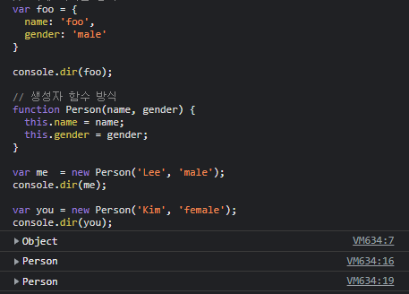
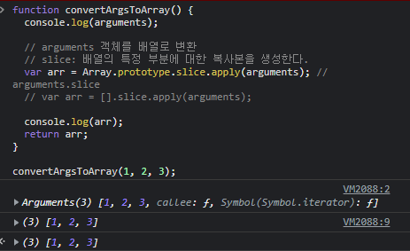
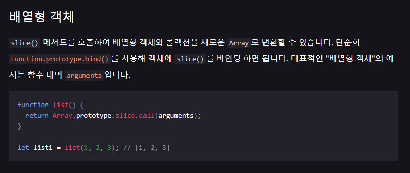
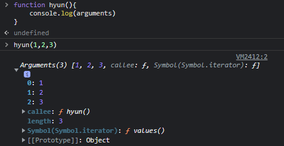

# 220309

## 함수 호출 방식에 의해 결정되는 this

자바스크립트의 함수는 호출될 때 매개변수로 전달되는 인자값 이외에 argument 객체와 this를 암묵적으로 전달받는다.

JAVA에서의 this는 인스턴스 자신을 가리키는 참조변수이다. 

하지만 자바스크립트의 경우 JAVA와 같이 바인딩 되는 객체는 한 가지가 아니라 해당 함수 호출 방식에 따라 this에 바인딩 되는 객체가 달라진다.

```java
public Class Person {

  private String name;

  public Person(String name) {
      //this.name 은 private String name임!
    this.name = name;
  }
}
```


### 함수 호출 방식과 this 바인딩

함수를 호출할 때 어떻게 호출되었는지에 따라 this에 바인딩이 동적으로 이루어진다

> 함수 호출하는 방식
>
> 1. 함수 호출
> 2. 메소드 호출
> 3. 생성자 함수 호출
> 4. apply/call/bind 호출

```js
var foo = function () {
  console.dir(this);
};

// 1. 함수 호출
foo(); // window
// window.foo();

// 2. 메소드 호출
var obj = { foo: foo };
obj.foo(); // obj

// 3. 생성자 함수 호출
var instance = new foo(); // instance

// 4. apply/call/bind 호출
var bar = { name: 'bar' };
foo.call(bar);   // bar
foo.apply(bar);  // bar
foo.bind(bar)(); // bar

```

#### 1. 함수 호출

전역 객체는 모든 객체의 유일한 최상위 객체를 의미하며 Browser-side에서는 window Server-side에서는 global 객체를 의미한다.

```js
// in browser console
this === window // true

// in Terminal
node
this === global // true
```

전역 객체는 전역 스코프를 갖는 전역변수를 프로퍼티로 소유한다. 글로벌 영역에서 선언한 함수는 전역객체의 프로퍼티로 접근할 수 있는 전역 변수의 메소드이다.(```this.method```)

심지어 내부함수에서도 외부함수가 아닌 전역객체에 바인딩된다.

```js
function foo() {
  console.log("foo's this: ",  this);  // window
  function bar() {
    console.log("bar's this: ", this); // window
  }
  bar();
}
foo();
```

또한 메소드 안의 내부함수일 경우에도 this는 전역객체에 바인딩된다.

```js
var value = 1;

var obj = {
  value: 100,
    //foo라는 프로퍼티의 메소드의 내부함수 bar
  foo: function() {
    console.log("foo's this: ",  this);  // obj
    console.log("foo's this.value: ",  this.value); // 100
    function bar() {
      console.log("bar's this: ",  this); // window
      console.log("bar's this.value: ", this.value); // 1
    }
    bar();
  }
};

obj.foo();
```


콜백함수의 경우에도 this는 전역객체에 바인딩된다.

```js
var value = 1;

var obj = {
  value: 100,
  foo: function() {
      //콜백함수
    setTimeout(function() {
      console.log("callback's this: ",  this);  // window
      console.log("callback's this.value: ",  this.value); // 1
    }, 100);
  }
};

obj.foo();
```


내부함수는 어디에서 선언되었든간에 this는 전역객체를 바인딩한다

내부함수의 this가 전역객체를 참조하는 것을 회피하는 방법

```js
var value = 1;
var obj = {
  value: 100,
  foo: function() {
      //메서드에서 변수에 할당함.
    var that = this;  // Workaround : this === obj

    console.log("foo's this: ",  this);  // obj
    console.log("foo's this.value: ",  this.value); // 100
      //내부함수에서 상위함수 변수에 접근해서 window 바인딩을 회피함.
    function bar() {
      console.log("bar's this: ",  this); // window
      console.log("bar's this.value: ", this.value); // 1

      console.log("bar's that: ",  that); // obj
      console.log("bar's that.value: ", that.value); // 100
    }
    bar();
  }
};

obj.foo();
```




#### 2. 메소드 호출

함수가 객체의 프로퍼티 값이면 메소드로서 호출된다. 이때 메소드 내부의 this는 해당 메소드를 소유한 객체 즉, 해당 메소드를 호출한 객체에 바인딩된다.

```js
var obj1 = {
  name: 'Lee',
  sayName: function() {
      //프로퍼티값으로서의 함수에서 this 는 해당 객체로 바인딩됨.
    console.log(this.name);
  }
}

var obj2 = {
  name: 'Kim'
}

obj2.sayName = obj1.sayName;

obj1.sayName();
obj2.sayName();
```


프로토타입 역시 같은 방식을 취한다.

```js
function Person(name) {
  this.name = name;
}
//프로토타입에 getName 프로퍼티를 추가함
Person.prototype.getName = function() {
  return this.name;
}

var me = new Person('Lee');
console.log(me.getName());

Person.prototype.name = 'Kim';
console.log(Person.prototype.getName());
```


#### 3. 생성자 함수 호출

기존 일반 함수에 new를 붙이면 생성자 함수로 동작함.

따라서 new를 붙이느냐 안붙이느냐에 따라 this의 바인딩이 다르게 동작함.

```js
// 생성자 함수
function Person(name) {
  this.name = name;
}

var me = new Person('Lee');
console.log(me); // Person {name: "Lee"}

// new 연산자와 함께 생성자 함수를 호출하지 않으면 생성자 함수로 동작하지 않는다.
var you = Person('Kim');
console.log(you); // undefined
```


#### - 생성자 함수 동작 방식

 new 연산자와 함께 생성자 함수를 호출하면 다음과 같은 수순으로 동작한다.

1. 빈 객체 생성 및 this 바인딩

- 생성자 함수 내에서 사용되는 this 는 빈 객체를 가리킨다. 생성된 빈 객체는 생성자 함수의 prototype 프로퍼티가 가리키는 객체를 자기 자신의 prototype 객체로 설정한다.

2. this를 통한 프로퍼티 생성

3. 생성된 객체 반환



#### - 객체 리터럴 방식과 생성자 함수의 차이

- 프로토타입 객체(내부슬롯[[prototype]])

  ```js
  // 객체 리터럴 방식
  var foo = {
    name: 'foo',
    gender: 'male'
  }
  
  console.dir(foo);
  
  // 생성자 함수 방식
  function Person(name, gender) {
    this.name = name;
    this.gender = gender;
  }
  
  var me  = new Person('Lee', 'male');
  console.dir(me);
  
  var you = new Person('Kim', 'female');
  console.dir(you);
  ```

  

  - 객체 리터럴의 경우 생성된 객체의 프로토타입 객체는 Object.prototype
  - 생성자 함수로 생성된 객체의 경우 프로토타입 객체는 Person.prototype


#### - 생성자 함수에 new 연산자를 붙이지 않고 호출할 경우

일반함수와 형식적 차이는 없으나 함수에 new 를 붙여 호출하면 해당 함수는 생성자 함수로 동작한다.

```js
function Person(name) {
  // new없이 호출하는 경우, 전역객체에 name 프로퍼티를 추가
  this.name = name;
};

// 일반 함수로서 호출되었기 때문에 객체를 암묵적으로 생성하여 반환하지 않는다.
// 일반 함수의 this는 전역객체를 가리킨다.
var me = Person('Lee');

//함수의 return 값이 없기 때문에 undefined로 출력
console.log(me); // undefined
console.log(window.name); // Lee
```

위와같은 문제 때문에 일반적으로 생성자 함수명은 첫문자를 대문자로 기술하여 혼란을 방지하려고 한다. 하지만 이것은 근본적인 해결책이 아니다.

위와 같은 위험성을 회피하기 위해 다음과 같은 패턴을 사용한다.

```js
// Scope-Safe Constructor Pattern
function A(arg) {
  // 생성자 함수가 new 연산자와 함께 호출되면 함수의 선두에서 빈객체를 생성하고 this에 바인딩한다.

  /*
  this가 호출된 함수(arguments.callee(자기 자신), 본 예제의 경우 A)의 인스턴스가 아니면 new 연산자를 사용하지 않은 것이므로 이 경우 new와 함께 생성자 함수를 호출하여 인스턴스를 반환한다.
  arguments.callee는 호출된 함수의 이름을 나타낸다. 이 예제의 경우 A로 표기하여도 문제없이 동작하지만 특정함수의 이름과 의존성을 없애기 위해서 arguments.callee를 사용하는 것이 좋다.
  */
  if (!(this instanceof arguments.callee)) {
    return new arguments.callee(arg);
  }

  // 프로퍼티 생성과 값의 할당
  this.value = arg ? arg : 0;
}

var a = new A(100);
var b = A(10);
		//new A(10)

console.log(a.value);
console.log(b.value);
```

> arguments.callee
>
> callee = argument객체의 속성
>
> 현재 실행중인 함수를 참조하는데 사용함(익명함수에서 특히 유용함)
>
> 함수 바디내에서 현재 실행중인 함수의 이름을 반환한다.
>
> https://developer.mozilla.org/ko/docs/Web/JavaScript/Reference/Functions/arguments/callee


#### 4. apply/call/bind 호출

this에 바인딩 될 객체는 함수 호출 패턴에 의해 결정된다는 것을 앞서 확인했다. 이는 JS 엔진이 수행하는 것인데 이러한 암묵적 this바인딩 이외에 this를 특정 객체에 명시적으로 바인딩하는 방법도 있다.

```Function.prototype.apply, Function.prototype.call```이 그것인데, 이는 모든 함수 객체의 프로토타입 객체인 Function.prototype 객체의 메소드이다.

```js
func.apply(thisArg, [argsArray])

// thisArg: 함수 내부의 this에 바인딩할 객체
// argsArray: 함수에 전달할 argument의 배열
```

위와같은 방식으로 사용한다.

여기서 중요한 점은 apply는 단지 함수 호출 기능일 뿐이라는 것이다.

```js
var Person = function (name) {
  this.name = name;
};

var foo = {};


// apply 메소드는 생성자함수 Person을 호출한다. 이때 this에 객체 foo를 바인딩한다.
Person.apply(foo, ['name']);
console.log(foo); // { name: 'name' }
```

apply 메소드의 용도는 유사배열 객체에 배열 메소드를 사용하는 경우이다.

예제는 다음과 같다.

```js
function convertArgsToArray() {
    //2
  console.log(arguments);

  // arguments 객체를 배열로 변환
  // slice: 배열의 특정 부분에 대한 복사본을 생성한다.
    //3
  var arr = Array.prototype.slice.apply(arguments); // arguments.slice
  // var arr = [].slice.apply(arguments);
	//4
  console.log(arr);
  return arr;
}
//1
convertArgsToArray(1, 2, 3);
```

결과는 아래와 같은데 





위 코드를 이해하기 위해 선행해야 하는 것

> https://developer.mozilla.org/ko/docs/Web/JavaScript/Reference/Global_Objects/Array/slice





```js
Array.prototype.slice.call === [].slice.call
```


call() 메소드의 경우 apply와 기능은 같지만 apply()의 두번째 인자에서 배열 형태로 넘긴 것을 각각 하나의 인자로 넘긴다.

```js
Person.apply(foo, [1,2,3])
Person.call(foo, 1,2,3)
```

