# 220310

## 실행 컨텍스트와 자바스크립트의 동작 원리


### 실행컨텍스트

실행 컨텍스트는 scope, hoisting, this, function, closure 등의 동작 원리를 담고 있는 자바 스크립트의 핵심 원리이다. 실행 컨텍스트를 바로 이해하지 못하면 코드 독해가 어려워지며 디버깅도 매우 곤란해진다.

실행 컨텍스트 : 실행 가능한 코드가 실행되기 위해 필요한 환경(?) 

일반적으로 실행 가능한 코드는 전역 코드와 함수 내 코드이다

다시말해서 전역코드와 함수 내 코드가 실행되기 위한 환경을 실행 컨텍스트라 한다.

코드를 실행하기 위해 JS 엔진은 다음과 같은 정보가 필요하다

- 변수 : 전역, 지역, 매개, 객체 프로퍼티
- 함수 선언
- 변수의 유효범위(Scope)
- this


위의 정보를 형상화하고 구분하기 위해 JS 엔진은 실행 컨텍스트를 물리적 객체의 형태로 관리하는데 그게 바로 Stack이다.

```js
var x = 'xxx';

function foo () {
  var y = 'yyy';

  function bar () {
    var z = 'zzz';
    console.log(x + y + z);
  }
  bar();
}
foo();
```


1. 컨트롤(제어권)이 실행 가능한 코드로 이동하면, 논리적 스택 구조를 가지는 새로운 실행 컨텍스트 스택이 생성된다. 스택은 LIFO의 구조를 가지는 나열구조이다.
2. 전역 코드로 컨트롤이 진입하면 전역 실행 컨텍스트가 생성되고 실행 컨텍스트 스택에 쌓인다. 전역 실행 컨텍스트는 애플리케이션이 종료될때(웹페이지에서 나가거나 브라우저를 닫을 때)까지 유지된다.
3. 함수를 호출하면 해당 함수의 실행 컨텍스트가 생성되며 직전에 실행된 코드 블록의 실행 컨텍스트 위에 쌓인다.
4. 함수 실행이 끝나면 해당 함수 실행 컨텍스트를 파기하고 직전의 실행 컨텍스트에 컨트롤을 반환한다.


### 실행 컨텍스트의 3가지 객체

#### 1. VO(변수객체/ Variable Object)

VO는 실행에 필요한 여러 정보들을 담는데 그 정보는 다음과 같다

- 변수
- 매개변수와 인수 정보
- 함수 선언(표현식은 제외)

코드가 실행될때 VO는 엔진에 의해 참조되며 코드에서는 접근할 수 없다.

VO는 실행 컨텍스트의 프로퍼티이기 때문에 값을 갖는데, 이 값은 다른 객체를 가리킨다.

VO는 전역 컨텍스트의 경우 전역 객체를 가리키는데 다음과 같다.

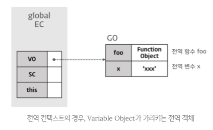

하지만 이 경우와 함수를 실행할 때 생성되는 함수 컨텍스트가 가리키는 객체는 다르다.

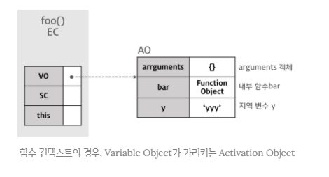

여기서의 AO를 활성객체(Activation Object)라 하며 매개변수와 인수들의 정보를 배열 형태로 담고있는 객체인 arguments object가 추가된다.


#### 2. Scope Chain(SC)

스코프 체인은 일종의 리스트로서 전역 객체와 중첩된 함수의 스코프의 레퍼런스를 차례로 저장하고 있다. 스코프 체인은 해당 전역 또는 함수가 참조할 수 있는 변수, 함수 선언 등의 정보를 담고 있는 전역 객체(GO) 또는 활성 객체(AO)의 리스트를 가리킨다.(코드와 함께 보기)

현재 실행 컨텍스트의 활성 객체(AO)를 선두로 순차적으로 상위 컨텍스트의 활성 객체(AO)를 가리키며 마지막 리스트는 전역 객체(GO)를 가리킨다.

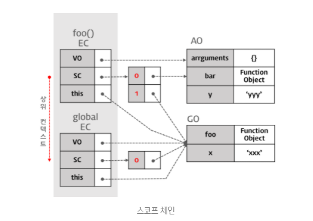

**스코프체인은 프로퍼티가 아닌 식별자, 즉 변수를 검색하는 메커니즘이다. 식별자 중에서 변수가 아닌 객체의 프로퍼티(메소드 포함)를 검색하는 메커니즘은 프로토타입 체인이다.**


엔진은 스코프 체인을 통해 렉시컬 스코프(어디서 선언하는지에 따라 스코프가 결정됨)를 파악한다.

내부함수는 상위함수와 전역함수를 모두 참조할 수 있는데 이것은 스코프 체인을 통해 가능하다. 함수가 중첩되어 있는 경우 부모 함수의 scope가 자식 함수의 scope chain에 포함된다. 

과정

1. 함수 실행중 변수를 만난다
2. 현재 스코프에서 변수를 찾는다.(AO)
3. 검색에 실패한다
4. 스코프 체인의 순서에 따라 상위 함수의 AO를 검색한다
5. 실패한다
6. 스코프 체인의 순서에 따라 GO를 검색한다.


####  this.value

this 프로퍼티에는 this 값이 할당된다. this에 할당되는 값은 함수 호출 패턴에 의해 결정된다. (생성형, 프로퍼티)


### 실행 컨텍스트의 생성 과정

##### 1. 전역 코드에 진입

실행 컨텍스트에 진입하기 이전에 전역객체가 생성된다.

- 전역 객체 안에는 빌트인 객체(Math, Array, String)와 BOM(Brouser Object Model == 브라우저에 대한 내용을 담고있는 객체), DOM(Document, Object Model == 문서에 대한 모든 내용을 담고있는 객체, 페이지에 대한 정보)를 가짐

##### 2. 전역 객체가 생성된 이후 전역 코드로 컨트롤이 진입하면 전역 실행 컨텍스트(global EC)가 생성되고 실행 컨텍스트 스택에 쌓인다.

##### 2.1 스코프 체인의 생성과 초기화

실행 컨텍스트가 생성된 이후 가장 먼저 스코프 체인의 생성과 초기화가 실행된다. 이때 스코프 체인은 전역 객체의 레퍼런스를 포함하는 리스트가 된다.

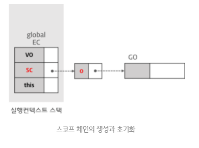

##### 2.2 변수 객체화(Variable Instantiation) 실행

스코프 체인의 생성과 초기화가 종료하면 변수 객체화가 실행된다.

변수 객체화는 VO에 프로퍼티와 값을 추가하는 것을 의미한다.[VO는 변수, 매개변수, 인수 정보, 함수 선언을 추가하기 때문에] 변수 객체화라 한다.

전역 코드의 경우 VO 는 GO를 참조한다.

변수 객체화는 반드시 다음과 같은 순서로 프로퍼티와 값을 set한다.(1->2->3순서)

1. Function Code의 경우 매개변수가 VO의 프로퍼티로 인수가 값으로 설정된다.

> 매개변수 : 전달되는 값을 받는 변수, 인수 : 전달되는 값

2. 대상 코드 내의 함수 선언(함수 표현식 제외 (얘는 변수임 ===> 스코프체인 ===> SC에 들어간다))을 대상으로 함수명이 VO의 프로퍼티로 생성된 함수 객체가 값으로 설정된다.(함수 호이스팅)
3. 대상 코드 내의 변수 선언을 대상으로 변수명이 VO의 프로퍼티로 undefined(선언과 할당이 분리되기 때문)가 값으로 설정된다.(변수 호이스팅)

**여기서 주목해야할 점 : 함수 호이스팅이 변수 호이스팅보다 우선함.**

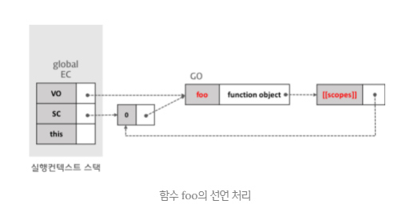

여기서 2번에 해당하는 VO의 프로퍼티 값으로 생성된 함수 객체 function object는 [[scopes]] 프로퍼티를 가진다.

[[scopes]]는 함수객체만이 소유하는 내부 프로퍼티로 함수 객체가 실행되는 환경을 가리킨다.

[[scopes]]의 프로퍼티는 따라서 현재 실행 컨텍스트의 스코프 체인이 참조하고 있는 객체를 값으로 설정.(위 그림에선  foo가 [[scopes]]프로퍼티의 값이된다.)

[[scopes]] 프로퍼티는 자신을 포함하는 외부함수의 실행환경과 전역객체를 모두 가리키는데 자신을 포함하는 외부 함수의 실행 컨텍스트가 소멸하여도 [[scopes]] 프로퍼티가 가리키는 외부 함수의 실행 환경(AO)은 소멸하지 않고 참조할 수 있다. 이것이 **클로저**이다.


Global AO를 참조함


이 때, 함수선언식의 경우 변수 객체(VO)에 함수표현식과 동일하게 함수명을 프로퍼티로 함수 객체를 할당함(변수 객체(VO)에 함수명을 프로퍼티로 추가하고 즉시 함수 객체를 즉시 할당함 (선언 -> 프로퍼티 추가 -> 할당 === 선언과 할당이 즉시 이루어짐(동적))). 하지만 함수 표현식은 일반 변수의 방식을 따른다(선언과 할당이 분리됨)

이를 함수 호이스팅이라하며 함수 표현식이 변수 호이스팅을 따르기 때문에 실행컨텍스트가 다르다는 것은 여기에서 비롯된 것이다.


변수 x의 선언 처리

**var 키워드로 선언된 변수는 선언 단계와 초기화 단계가 한번에 이루어진다.** 다시 말해 스코프 체인이 가리키는 변수 객체에 변수가 등록되고 변수는 undefined로 초기화된다. 따라서 변수 선언문 이전에 변수에 접근하여도 Variable Object에 변수가 존재하기 때문에 에러가 발생하지 않는다. 다만 undefined를 반환한다.

이를 변수 호이스팅이라 한다.

이후 변수 할당문에 도달했을때 비로소 값이 할당된다.


##### 2.3 this.value의 결정

변수 선언 처리가 끝나면 다음은 this value가 결정된다. this value가 결정되기 이전에 this는 전역 객체를 가리키고 있다가 함수 호출 패턴(생성자인지 아닌지)에 의해 this에 할당되는 값이 결정된다. 전역 코드의 경우 this는 전역 객체를 가리킨다.


전역 컨텍스트에서는 this는  항상 전역객체(window)이다


### 실행환경 이후

#### 전역 코드의 실행

```js
var x = 'xxx';

function foo () {
  var y = 'yyy';

  function bar () {
    var z = 'zzz';
    console.log(x + y + z);
  }
  bar();
}

foo();
```


#### 1. 변수 값의 할당 : 값을 할당 할 때 현재 실행 컨텍스트의 SC가 참조하고 있는 VO를 선두(index 0) 부터 검색하여 변수명에 해당하는 프로퍼티가 발견되면 값 'xxx'를 할당한다.


#### 2. 함수 foo의 실행 

전역 코드의 함수 foo가 실행되면 새로운 함수 실행 컨텍스트가 생성된다. foo의 실행 컨텍스트로 컨트롤이 이동하면 전역 코드의 경우와 마찬가지로 이루어진다

1. 스코프 체인의 생성과 초기화

- AO에 대한 참조를 스코프 체인의 선두[index 0]에 설정한다

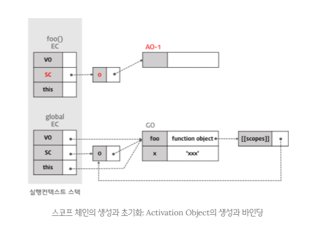

- arguments 프로퍼티의 초기화를 실행한다.

2. Variable Instantiation(변수 객체화) 

- Caller(전역 컨텍스트)의 Scope Chain이 참조하고 있는 객체가 스코프 체인에 push된다.


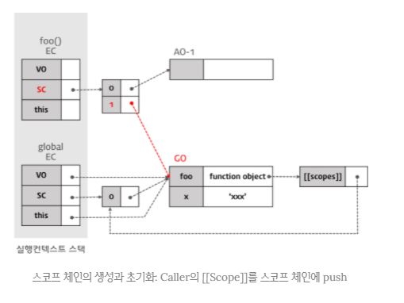

- 함수 객체를 AO- 1(변수객체 로서 Variable Instantiation 실행)에 바인딩한다(bar : Function Object)

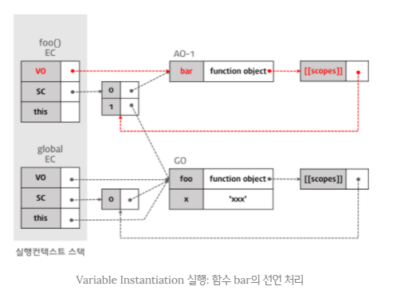

- 변수 y를 AO - 1(VO)에 설정한다. 

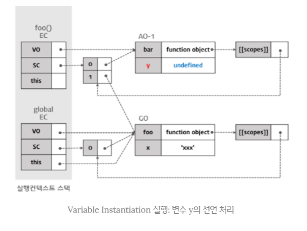

3. this.value 결정이 순차적으로 진행된다.

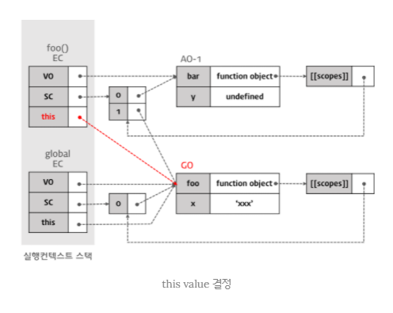

foo를 참조하는 this와 VO(전역 컨텍스트의 변수 객체)가 같음을 알 수 있음


4. 이후 값을 할당한다.

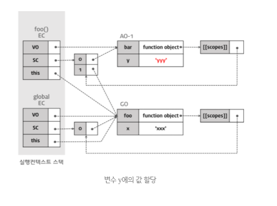

5. bar가 실행되기 시작하면 새로운 실행 컨텍스트가 생성된다. 

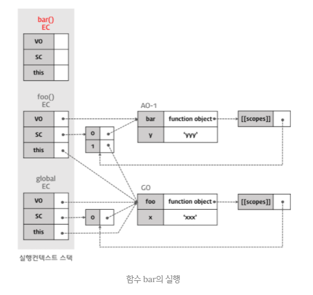
